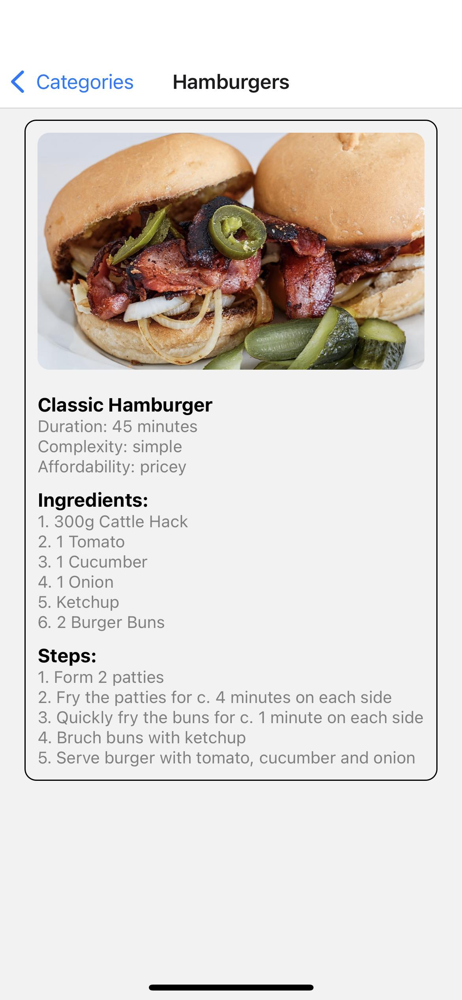
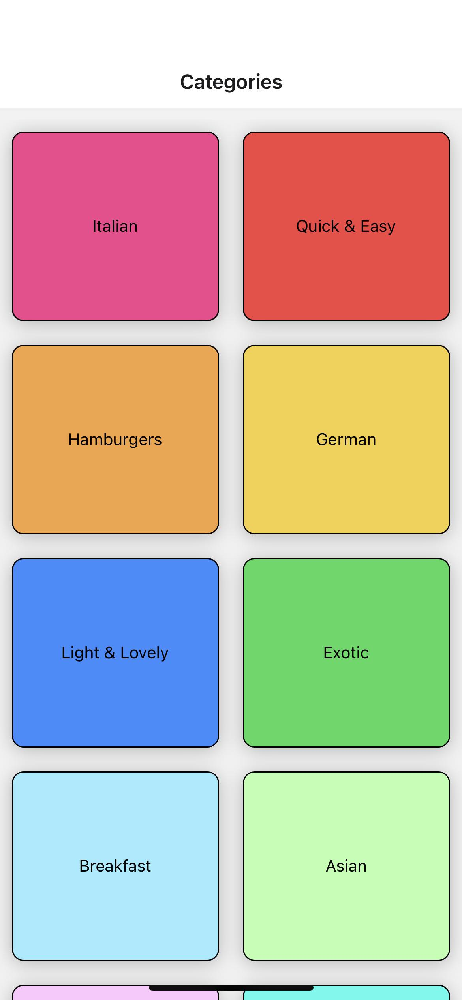

# My Awesome Recipe App

Welcome to the My Awesome Recipe App! This app allows you to explore delicious meals and recipes. 

## Screenshots

### Home Screen

### Meal Screen

## Features

- Browse a variety of meals categorized by cuisine.
- View detailed information about each meal, including ingredients and steps.
- Discover new recipes to try at home.

## Getting Started

To get started with the app, follow these steps:

1. Clone the repository: `git clone https://github.com/your-username/your-repo.git`
2. Install dependencies: `npm install` or `yarn install`
3. Run the app: `npm start` or `yarn start`

## Technologies Used

- React Native
- React Navigation
- Other libraries/frameworks used in the project

## Contributing

If you'd like to contribute to this project, feel free to fork the repository and submit a pull request.

## License

This project is licensed under the [MIT License](LICENSE).

